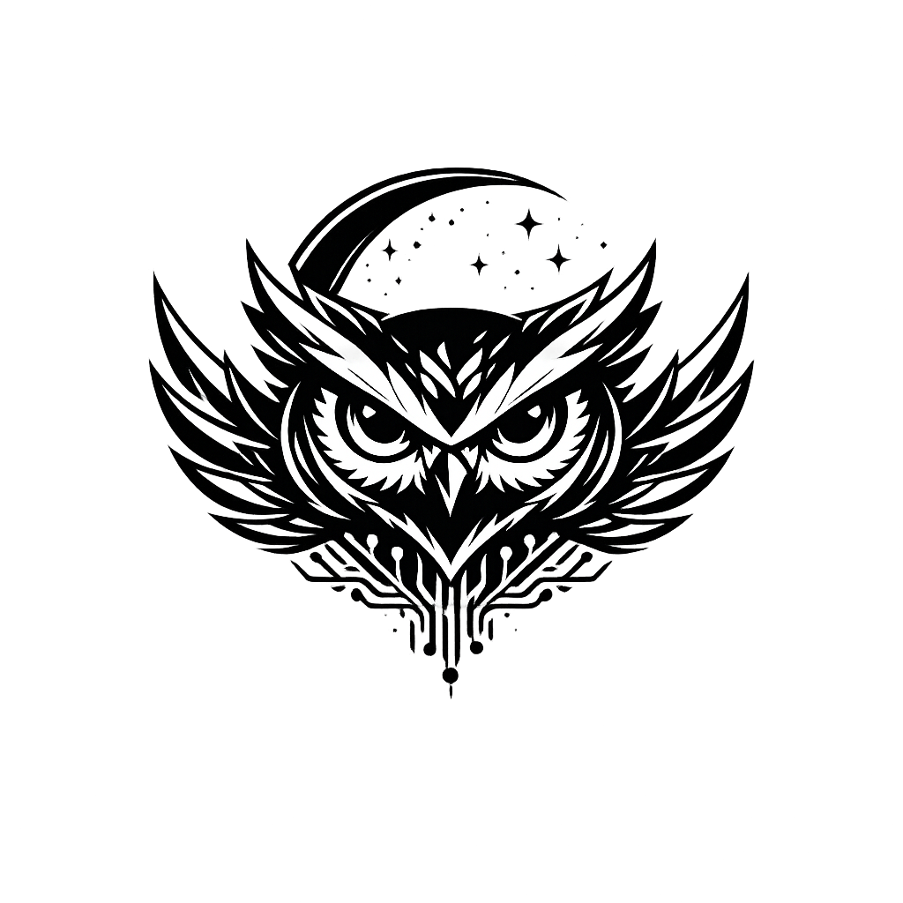

<div align="center">
  
  &nbsp;&nbsp;&nbsp;
  

  <h1>Abhishek Panda Platform</h1>
  <p>
    Personal brand website, AI portfolio, OpenOwl assistant experience, and admin control center.
  </p>
</div>

<p align="center">
  
  
  
  
  
  
</p>

## Tags
`#AbhishekPanda` `#OpenOwl` `#AI` `#AgenticAI` `#Portfolio` `#React` `#TypeScript` `#Vite` `#TailwindCSS` `#Supabase` `#PWA` `#SEO`

## About
This repository powers **abhishekpanda.com** with:
- Public brand site (about, blog, courses, ebooks, products, mentorship, contact)
- **OpenOwl** public assistant experience
- **OpenOwl Admin Center** for content and delivery operations
- Main admin command center for business, CMS, analytics, security, and workflow management
- **Strapi v5 CMS engine** embedded in the admin studio at `/admin/cms`

## OpenOwl (In Development)
**OpenOwl** is the AI assistant platform layer inside this project.

Current implementation includes:
- `/openowl` landing page
- `/openowl/assistant` full-screen assistant UI
- `/openowl/admin` and sub-pages (`studio`, `publish`, `delivery`, `runs`, `settings`)
- Embeddable chat widget component (`OpenOwlWidget`)
- Mock streaming responses and typed mock data
- Mermaid preview component with strict rendering safeguards
- Prompt pack + tool schema docs under `docs/openowl/`

Roadmap direction:
- Open-source LLM integrations
- Production-grade tool execution + approvals
- Deeper retrieval and source-grounded responses

## Core Features
- Modern, responsive UI (mobile, tablet, desktop)
- Theme-aware branding and iconography
- Rich blog and long-form content delivery
- Ebooks with OTP and secure access flows
- Admin center with role/security workflows
- OpenOwl assistant and OpenOwl admin IA
- Social links and profile integrations
- SEO assets (`robots.txt`, sitemap files, llms.txt)
- PWA support with service worker caching

## Tech Stack

### Frontend
- React 18
- TypeScript
- Vite
- React Router
- Tailwind CSS
- shadcn/ui + Radix UI
- Framer Motion + GSAP

### AI / Assistant UI
- OpenOwl chat UI and widget
- Mermaid rendering (`mermaid`)
- Markdown rendering (`react-markdown`, `remark-gfm`)

### Data / Backend
- Supabase (Auth, Postgres, Storage)
- Strapi v5 CMS (`/cms` workspace, dynamic zones, custom fields)
- TanStack Query
- Edge-function compatible structure

### Tooling
- ESLint
- Vite PWA plugin
- Node scripts for build and prerender

## Route Highlights

### Public
- `/`
- `/about`
- `/blog`, `/blog/:slug`
- `/courses`, `/courses/:courseId`
- `/ebooks`, `/ebooks/:slug`, `/ebooks/:slug/read`
- `/products`
- `/mentorship`
- `/contact`
- `/llm-galaxy`, `/llm-galaxy/model/:modelId`
- `/chronyx`
- `/openowl`, `/openowl/assistant`

### Admin
- `/admin` (main admin center)
- `/admin/login`, `/admin/register-passkey`
- `/admin/cms` (Strapi-powered CMS workspace + embedded Strapi admin)

### OpenOwl Admin
- `/openowl/admin`
- `/openowl/admin/studio`
- `/openowl/admin/publish`
- `/openowl/admin/delivery`
- `/openowl/admin/runs`
- `/openowl/admin/settings`

## Quick Start

```bash
npm install
npm run dev
```

Local dev server runs on:
- `http://localhost:8080` (Vite admin studio/public site)
- `http://localhost:1337` (Strapi backend)

### CMS Environment Setup
1. Copy `cms/.env.example` to `cms/.env`.
2. Keep `DATABASE_CLIENT=sqlite` for local development.
3. For production with Supabase Postgres, switch `DATABASE_CLIENT=postgres` and fill the Postgres values in `cms/.env`.
4. Optionally set `BUILD_HOOK_URL` in `cms/.env` to auto-trigger public site rebuilds on publish/update.

Optional frontend env vars:
- `VITE_CMS_ORIGIN` (default `http://localhost:1337`) for Vite proxy target.
- `VITE_CMS_API_BASE` (default `/cms-api`) and `VITE_CMS_ADMIN_URL` (default `/cms-admin`).
- `VITE_CMS_API_TOKEN` for authenticated CMS API indexing in `/admin/cms`.

### Content Authoring Flow
1. Sign into the existing Supabase admin login (`/admin/login`).
2. Open `/admin/cms` to access:
   - Embedded Strapi admin panel (iframe/proxy)
   - Instant Fuse.js search over indexed `BlogPost` entries
   - Preview pane with scroll-spy + reading progress
3. Create/edit content in Strapi:
   - `BlogPost`, `Course`, `InterviewPack`, `Tag`
   - Dynamic zone blocks: `richText`, `codeBlock`, `mermaidDiagram`, `callout`, `imageBlock`, `embed`, `tabs`, `steps`, `checklist`
4. Publish from Strapi. If `BUILD_HOOK_URL` is set, a rebuild webhook is triggered automatically.

## Build and Preview

```bash
npm run build
npm run preview
```

## Scripts
- `npm run dev` - start development server
- `npm run dev:web` - start Vite only
- `npm run dev:cms` - start Strapi CMS only (forced Node 24 runtime)
- `npm run build` - production build + blog prerender
- `npm run cms:build` - build Strapi admin
- `npm run build:dev` - development-mode build
- `npm run lint` - run lint checks
- `npm run test:ebooks-otp` - run ebook OTP tests
- `npm run supabase:status` - inspect migration state
- `npm run supabase:migration:new -- <name>` - create migration
- `npm run supabase:push` - push pending migrations
- `npm run supabase:types` - regenerate Supabase types

## SEO and Discoverability
This project includes:
- `public/robots.txt`
- `public/sitemap.xml`
- `public/sitemaps.xml`
- `public/llms.txt`
- Route-level metadata and structured schema support

## Project Structure
```text
src/
  components/
    about/
    layout/
    openowl/
    openowl-widget/
    admin/
  pages/
    openowl-admin/
  lib/
    openowl/
    social/
  data/
  types/
docs/
  openowl/
public/
  brand-logos/
  llm-logos/
  openOwl-logo.PNG
  Abhishek.PNG
```

## Documentation
OpenOwl prompt and tool-call references:
- `docs/openowl/prompt-pack.md`
- `docs/openowl/tool-calls.schema.json`
- `docs/openowl/tool-call-examples.json`

## License
Copyright © Abhishek Panda. All rights reserved.
