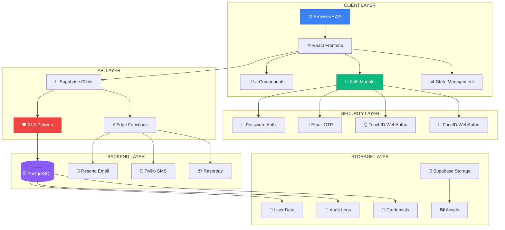
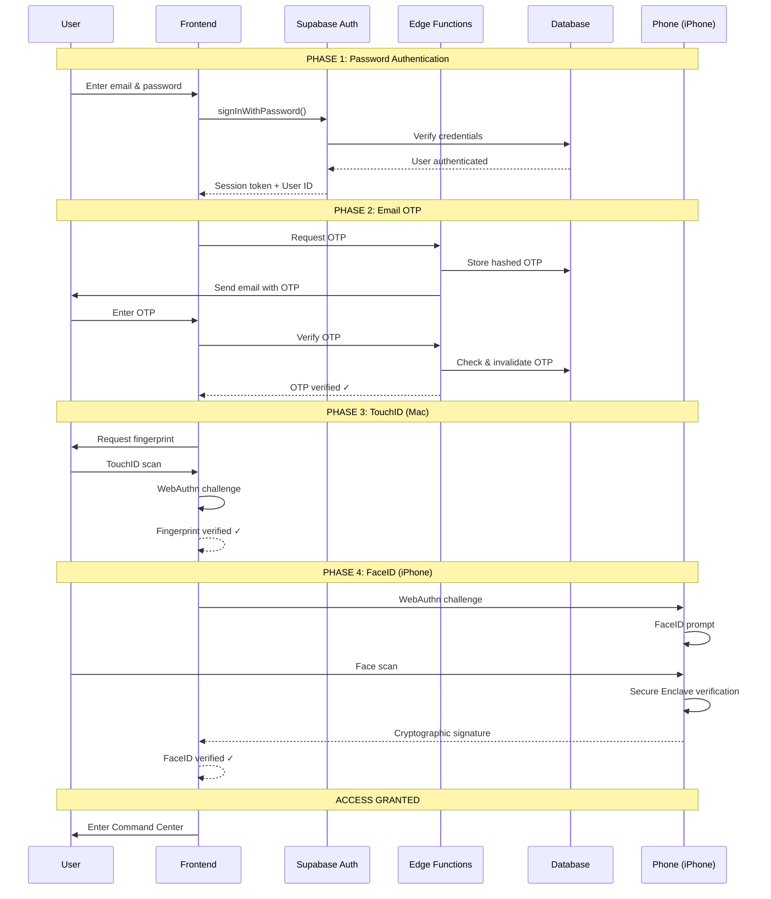
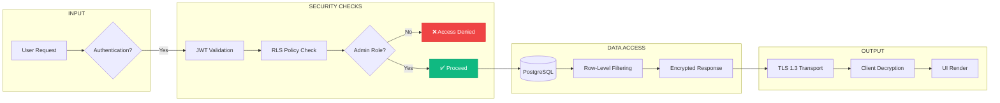
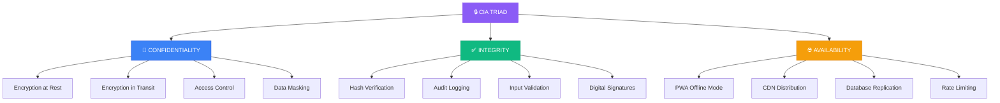

# Abhishek Panda Command Center
## Technology Stack & CIA-Level Security Documentation

---

## Table of Contents

1. [Executive Summary](#executive-summary)
2. [System Architecture Diagram](#system-architecture-diagram)
3. [Technology Stack](#technology-stack)
4. [CIA Security Triad](#cia-security-triad)
5. [Authentication Architecture](#authentication-architecture)
6. [Dual-Biometric Flow](#dual-biometric-flow)
7. [Security Layers](#security-layers)
8. [Data Protection](#data-protection)
9. [Network Security](#network-security)
10. [Audit & Monitoring](#audit--monitoring)
11. [PWA & Offline Security](#pwa--offline-security)
12. [Best Practices Implemented](#best-practices-implemented)

---

## Executive Summary

The Abhishek Panda Command Center is an enterprise-grade personal admin dashboard implementing **CIA-level security** (Confidentiality, Integrity, Availability). This document explains the technologies used and how each security layer works together to create a fortress-like protection for sensitive data.

### Security Rating: ⭐⭐⭐⭐⭐ (Enterprise Grade)

---

## System Architecture Diagram

### High-Level Architecture



### Authentication Flow Diagram



### Data Flow Diagram



### Module Security Architecture

```mermaid
graph TB
    subgraph "PUBLIC MODULES"
        A[🏠 Home Page]
        B[📖 Blog]
        C[📚 Courses]
        D[🛒 Products]
    end

    subgraph "AUTHENTICATED MODULES"
        E[📊 Dashboard]
        F[📈 Analytics]
        G[📬 Contact Requests]
        H[📄 CV Downloads]
    end

    subgraph "BIOMETRIC-SECURED MODULES"
        I[🔒 AETHERGRID]
        J[🔒 CMS Studio]
        K[🔒 LMS Studio]
        L[🔒 Astra Vault]
        M[🔒 FINCORE]
        N[🔒 LifeMap]
        O[🔒 Integrations]
        P[🔒 System Settings]
    end

    Q{Login} --> |Public| A
    Q --> |Public| B
    Q --> |Public| C
    Q --> |Public| D

    R{Admin Auth} --> |JWT + 2FA| E
    R --> |JWT + 2FA| F
    R --> |JWT + 2FA| G
    R --> |JWT + 2FA| H

    S{Biometric Gate} --> |WebAuthn| I
    S --> |WebAuthn| J
    S --> |WebAuthn| K
    S --> |WebAuthn| L
    S --> |WebAuthn| M
    S --> |WebAuthn| N
    S --> |WebAuthn| O
    S --> |WebAuthn| P

    style I fill:#ef4444,stroke:#dc2626,color:#fff
    style J fill:#ef4444,stroke:#dc2626,color:#fff
    style K fill:#ef4444,stroke:#dc2626,color:#fff
    style L fill:#ef4444,stroke:#dc2626,color:#fff
    style M fill:#ef4444,stroke:#dc2626,color:#fff
    style N fill:#ef4444,stroke:#dc2626,color:#fff
    style O fill:#ef4444,stroke:#dc2626,color:#fff
    style P fill:#ef4444,stroke:#dc2626,color:#fff
```



---

## Technology Stack

### Frontend Technologies

| Technology | Purpose | Version |
|------------|---------|---------|
| **React 18** | UI Framework | ^18.3.1 |
| **TypeScript** | Type-safe JavaScript | ^5.x |
| **Vite** | Build tool & dev server | ^5.x |
| **TailwindCSS** | Utility-first CSS | ^3.x |
| **Framer Motion** | Animations | ^12.x |
| **React Router** | Client-side routing | ^6.x |
| **TanStack Query** | Server state management | ^5.x |
| **Shadcn/UI** | Component library | Latest |
| **Lucide React** | Icon system | ^0.462.0 |
| **Recharts** | Data visualization | ^2.x |

### Backend Technologies

| Technology | Purpose |
|------------|---------|
| **Supabase** | Backend-as-a-Service (BaaS) |
| **PostgreSQL** | Primary database |
| **Edge Functions** | Serverless compute (Deno) |
| **Row Level Security (RLS)** | Database-level access control |
| **Supabase Auth** | Authentication service |
| **Supabase Storage** | File storage with policies |
| **Supabase Realtime** | WebSocket subscriptions |

### Security Technologies

| Technology | Purpose |
|------------|---------|
| **WebAuthn/FIDO2** | Passwordless biometric auth |
| **Passkey Continuity** | Cross-device biometric (iPhone FaceID) |
| **TOTP/HOTP** | Time-based OTP |
| **bcrypt/Argon2** | Password hashing |
| **JWT** | Token-based auth |
| **TLS 1.3** | Transport encryption |

### External Services

| Service | Purpose |
|---------|---------|
| **Resend** | Transactional emails |
| **Twilio** | SMS notifications |
| **Razorpay** | Payment processing |
| **Mapbox** | Geolocation services |

---

## CIA Security Triad

The CIA Triad is a model designed to guide policies for information security. Our implementation addresses all three pillars:



---

## Dual-Biometric Flow (TouchID → iPhone FaceID)

The Command Center implements dual-biometric authentication via Apple Passkey Continuity:
1. **Step 3**: TouchID on Mac (WebAuthn Challenge #1)
2. **Step 4**: FaceID on iPhone (WebAuthn Challenge #2 via Passkey Continuity)

This uses hardware-backed Secure Enclave - NO camera access, NO biometric data stored.

---

### 1. Confidentiality

**Goal:** Ensure data is only accessible to authorized users.

#### Implementation:

- **Row Level Security (RLS):** Every database table has RLS policies
- **Role-Based Access Control (RBAC):** Admin, Moderator, User roles
- **Encryption at Rest:** PostgreSQL encrypted storage
- **Encryption in Transit:** TLS 1.3 for all connections
- **Data Masking:** Phone numbers, sensitive fields masked in UI
- **Token-based Auth:** JWT with short expiration

### 2. Integrity

**Goal:** Ensure data cannot be tampered with.

#### Implementation:

- **Database Constraints:** Foreign keys, unique constraints, check constraints
- **Audit Logging:** Every login attempt, action logged with timestamp
- **Hash Verification:** Password hashing with bcrypt
- **Immutable Audit Trail:** Append-only audit logs
- **Input Validation:** Client and server-side validation

### 3. Availability

**Goal:** Ensure system is accessible when needed.

#### Implementation:

- **PWA Offline Support:** Service worker caching
- **CDN Distribution:** Static assets globally distributed
- **Database Replication:** Supabase managed replication
- **Rate Limiting:** Protection against DDoS
- **Graceful Degradation:** Offline fallback pages

---

## Authentication Architecture

### 4-Phase Authentication Flow

```
┌──────────────────────────────────────────────────────────────────────────────┐
│                        AUTHENTICATION FLOW                                     │
├──────────────────────────────────────────────────────────────────────────────┤
│                                                                               │
│  ┌─────────┐    ┌─────────┐    ┌─────────┐    ┌─────────┐    ┌─────────┐    │
│  │  USER   │───▶│ PHASE 1 │───▶│ PHASE 2 │───▶│ PHASE 3 │───▶│ SUCCESS │    │
│  │ ACCESS  │    │EMAIL/PWD│    │  2FA    │    │BIOMETRIC│    │ GRANTED │    │
│  └─────────┘    └─────────┘    └─────────┘    └─────────┘    └─────────┘    │
│                      │              │              │                          │
│                      ▼              ▼              ▼                          │
│                 ┌─────────┐   ┌─────────┐   ┌─────────┐                      │
│                 │Supabase │   │  Email  │   │ WebAuthn│                      │
│                 │  Auth   │   │   OTP   │   │ FIDO2   │                      │
│                 └─────────┘   └─────────┘   └─────────┘                      │
│                                                                               │
└──────────────────────────────────────────────────────────────────────────────┘
```

### Phase 1: Email/Password Authentication

```typescript
// User submits credentials
const { data, error } = await supabase.auth.signInWithPassword({
  email: userEmail,
  password: userPassword
});

// Supabase handles:
// 1. Password hash verification (bcrypt)
// 2. Session token generation (JWT)
// 3. Refresh token creation
```

**Security Features:**
- Passwords hashed with bcrypt (cost factor 10)
- Rate limiting: 5 attempts per 15 minutes
- Account lockout after consecutive failures
- Secure session cookies (HttpOnly, SameSite=Strict)

### Phase 2: Two-Factor Authentication (2FA)

```typescript
// OTP Generation (Server-side)
const otp = crypto.randomInt(100000, 999999).toString();
const expiresAt = new Date(Date.now() + 5 * 60 * 1000); // 5 minutes

// Store in database
await supabase.from('admin_otp_codes').insert({
  user_id: userId,
  otp_code: hashOtp(otp), // Hashed before storage
  expires_at: expiresAt
});

// Send via Email (Resend API)
await resend.emails.send({
  from: 'security@abhishekpanda.com',
  to: userEmail,
  subject: '🔐 Your OTP Code',
  html: otpTemplate
});
```

**Security Features:**
- OTP expires in 5 minutes
- One-time use (invalidated after verification)
- Hashed storage in database
- Delivered via authenticated email domain

### Phase 3: Biometric Authentication (WebAuthn)

```typescript
// Registration (First-time setup)
const credential = await navigator.credentials.create({
  publicKey: {
    challenge: serverChallenge,
    rp: { name: "AP Command Center", id: window.location.hostname },
    user: {
      id: userId,
      name: userEmail,
      displayName: userName
    },
    pubKeyCredParams: [
      { alg: -7, type: "public-key" },   // ES256
      { alg: -257, type: "public-key" }  // RS256
    ],
    authenticatorSelection: {
      authenticatorAttachment: "platform",
      userVerification: "required"
    }
  }
});

// Authentication (Subsequent logins)
const assertion = await navigator.credentials.get({
  publicKey: {
    challenge: serverChallenge,
    allowCredentials: [{
      id: credentialId,
      type: 'public-key'
    }],
    userVerification: 'required'
  }
});
```

**Supported Biometric Methods:**
- Face ID (iOS/macOS)
- Touch ID (iOS/macOS)
- Windows Hello (Windows)
- Fingerprint sensors (Android/Windows)
- Hardware security keys (YubiKey, etc.)

**Security Features:**
- Private keys never leave device
- Hardware-backed secure enclave
- Challenge-response prevents replay attacks
- No biometric data stored on server

---

## Security Layers

### Layer 1: Network Security

```
┌─────────────────────────────────────────────────────────────────┐
│                      NETWORK LAYER                               │
├─────────────────────────────────────────────────────────────────┤
│                                                                  │
│  ┌──────────┐   ┌───────────┐   ┌──────────┐   ┌────────────┐  │
│  │  Client  │──▶│    TLS    │──▶│   CDN    │──▶│  Supabase  │  │
│  │  (HTTPS) │   │   1.3     │   │  (Edge)  │   │  (Backend) │  │
│  └──────────┘   └───────────┘   └──────────┘   └────────────┘  │
│                                                                  │
│  Security Controls:                                              │
│  • HSTS (Strict-Transport-Security)                             │
│  • Certificate Pinning                                           │
│  • Perfect Forward Secrecy                                       │
│  • CSP (Content-Security-Policy)                                 │
│                                                                  │
└─────────────────────────────────────────────────────────────────┘
```

### Layer 2: Application Security

```
┌─────────────────────────────────────────────────────────────────┐
│                    APPLICATION LAYER                             │
├─────────────────────────────────────────────────────────────────┤
│                                                                  │
│  Input Validation                                                │
│  ├── Client-side: Zod schema validation                         │
│  ├── Server-side: PostgreSQL constraints                        │
│  └── Edge Functions: Request validation                          │
│                                                                  │
│  Output Encoding                                                 │
│  ├── React automatic XSS prevention                             │
│  ├── JSON response sanitization                                  │
│  └── HTML entity encoding                                        │
│                                                                  │
│  Session Management                                              │
│  ├── JWT with 1-hour expiration                                 │
│  ├── Refresh tokens with 7-day expiration                       │
│  ├── Secure cookie flags                                         │
│  └── Session invalidation on logout                              │
│                                                                  │
└─────────────────────────────────────────────────────────────────┘
```

### Layer 3: Database Security

```sql
-- Row Level Security Example
-- Users can only see their own data

CREATE POLICY "Users can view their own data"
ON public.profiles
FOR SELECT
USING (auth.uid() = id);

-- Admin override using security definer function
CREATE POLICY "Admins can view all data"
ON public.profiles
FOR SELECT
USING (public.has_role(auth.uid(), 'admin'));
```

**RLS Policy Categories:**

| Policy Type | Description | Example |
|-------------|-------------|---------|
| **SELECT** | Read access control | `auth.uid() = user_id` |
| **INSERT** | Create access control | `auth.uid() = user_id` |
| **UPDATE** | Modify access control | `auth.uid() = user_id` |
| **DELETE** | Remove access control | `auth.uid() = user_id` |

### Layer 4: Module-Level Security

```
┌─────────────────────────────────────────────────────────────────┐
│                MODULE-LEVEL BIOMETRIC GATES                      │
├─────────────────────────────────────────────────────────────────┤
│                                                                  │
│  Secured Modules (Require Re-authentication):                   │
│                                                                  │
│  ┌─────────────┐  ┌─────────────┐  ┌─────────────┐             │
│  │  AETHERGRID │  │ CMS Studio  │  │ LMS Studio  │             │
│  │  (Workflows)│  │  (Content)  │  │  (Courses)  │             │
│  └──────┬──────┘  └──────┬──────┘  └──────┬──────┘             │
│         │                │                │                      │
│         └────────────────┼────────────────┘                      │
│                          ▼                                       │
│                 ┌─────────────────┐                             │
│                 │   BIOMETRIC     │                             │
│                 │  VERIFICATION   │                             │
│                 │    MODAL        │                             │
│                 └─────────────────┘                             │
│                                                                  │
│  ┌─────────────┐  ┌─────────────┐  ┌─────────────┐             │
│  │ Astra Vault │  │   FINCORE   │  │   LifeMap   │             │
│  │  (Encrypted)│  │  (Finance)  │  │  (Personal) │             │
│  └─────────────┘  └─────────────┘  └─────────────┘             │
│                                                                  │
└─────────────────────────────────────────────────────────────────┘
```

---

## Data Protection

### Encryption Standards

| Data Type | At Rest | In Transit | Method |
|-----------|---------|------------|--------|
| Passwords | ✅ | ✅ | bcrypt (cost 10) |
| OTP Codes | ✅ | ✅ | SHA-256 hash |
| Session Tokens | ✅ | ✅ | JWT + AES-256 |
| Personal Data | ✅ | ✅ | PostgreSQL encryption |
| Files | ✅ | ✅ | Supabase Storage encryption |
| API Keys | ✅ | ✅ | Vault secrets |

### Data Classification

```
┌────────────────────────────────────────────────────────────┐
│                   DATA CLASSIFICATION                       │
├────────────────────────────────────────────────────────────┤
│                                                             │
│  🔴 CRITICAL (Highest Protection)                          │
│  ├── Biometric credentials (passkey_credentials)           │
│  ├── Admin OTP codes (admin_otp_codes)                     │
│  ├── Payment information (payments, invoices)              │
│  └── API secrets (Supabase secrets)                        │
│                                                             │
│  🟠 SENSITIVE (High Protection)                            │
│  ├── User profiles (profiles)                              │
│  ├── Login audit logs (login_audit_logs)                   │
│  ├── Family data (family_members)                          │
│  └── Contact requests (contact_requests)                   │
│                                                             │
│  🟡 INTERNAL (Standard Protection)                         │
│  ├── Blog posts (blog_posts)                               │
│  ├── Courses (courses)                                     │
│  ├── Products (products)                                   │
│  └── Dashboard widgets (dashboard_widgets)                 │
│                                                             │
│  🟢 PUBLIC (Minimal Protection)                            │
│  ├── Published content (is_published = true)               │
│  ├── Public profiles                                        │
│  └── LLM models (llm_models)                               │
│                                                             │
└────────────────────────────────────────────────────────────┘
```

---

## Network Security

### Geo-Blocking & Rate Limiting

```typescript
// IP Access Control Logic
interface IPAccessRule {
  ip_address: string;
  rule_type: 'whitelist' | 'blacklist';
  is_active: boolean;
  expires_at?: string;
  reason?: string;
}

// Rate Limiting Configuration
const RATE_LIMITS = {
  login: {
    maxAttempts: 5,
    windowMs: 15 * 60 * 1000, // 15 minutes
    blockDurationMs: 60 * 60 * 1000 // 1 hour
  },
  otp: {
    maxAttempts: 3,
    windowMs: 5 * 60 * 1000
  },
  api: {
    maxRequests: 100,
    windowMs: 60 * 1000
  }
};
```

### New Location Detection

```
┌─────────────────────────────────────────────────────────────────┐
│              NEW LOCATION LOGIN FLOW                             │
├─────────────────────────────────────────────────────────────────┤
│                                                                  │
│  1. User attempts login from new IP                             │
│                     │                                            │
│                     ▼                                            │
│  2. System detects new geolocation                              │
│                     │                                            │
│                     ▼                                            │
│  3. Email notification sent with:                               │
│     • IP Address                                                 │
│     • Location (City, Country)                                   │
│     • Device/Browser info                                        │
│     • Confirmation link                                          │
│                     │                                            │
│                     ▼                                            │
│  4. User must click confirmation link                           │
│                     │                                            │
│         ┌──────────┴──────────┐                                 │
│         ▼                     ▼                                  │
│  ┌─────────────┐      ┌─────────────┐                           │
│  │  CONFIRMED  │      │   DENIED    │                           │
│  │ Add to safe │      │ Block IP +  │                           │
│  │  locations  │      │ Alert admin │                           │
│  └─────────────┘      └─────────────┘                           │
│                                                                  │
└─────────────────────────────────────────────────────────────────┘
```

---

## Audit & Monitoring

### Login Audit Trail

Every authentication event is logged with:

```typescript
interface LoginAuditLog {
  id: string;
  email: string;
  status: 'attempt' | 'success' | 'failed' | '2fa_required' | 'blocked';
  ip_address: string;
  user_agent: string;
  browser: string;
  device_type: string;
  city: string;
  country: string;
  failure_reason?: string;
  created_at: string;
}
```

### Security Alert Triggers

| Event | Alert Type | Notification |
|-------|------------|--------------|
| 2+ failed logins | 🔴 Critical | Email + SMS |
| New location login | 🟠 Warning | Email |
| Biometric failure | 🟠 Warning | Email |
| IP blacklist hit | 🔴 Critical | Email + SMS |
| Unusual activity | 🟡 Info | Email |

### Real-time Security Dashboard

```
┌─────────────────────────────────────────────────────────────────┐
│                 SECURITY MONITORING DASHBOARD                    │
├─────────────────────────────────────────────────────────────────┤
│                                                                  │
│  ┌──────────────┐  ┌──────────────┐  ┌──────────────┐          │
│  │ Login Stats  │  │ Threat Map   │  │ Active Users │          │
│  │              │  │              │  │              │          │
│  │ Success: 156 │  │  [World Map  │  │    Online: 3 │          │
│  │ Failed: 12   │  │   with heat  │  │   Devices: 5 │          │
│  │ Blocked: 3   │  │   indicators]│  │              │          │
│  └──────────────┘  └──────────────┘  └──────────────┘          │
│                                                                  │
│  Recent Security Events:                                         │
│  ├── 10:23 AM - Successful biometric login (Chrome/Windows)    │
│  ├── 09:45 AM - Failed OTP attempt (blocked after 3 tries)     │
│  ├── 09:12 AM - New location detected (Mumbai, IN) - Confirmed │
│  └── 08:30 AM - Passkey registered (iPhone 15 Pro)             │
│                                                                  │
└─────────────────────────────────────────────────────────────────┘
```

---

## PWA & Offline Security

### Service Worker Security

```javascript
// Caching Strategies

// 1. Network First (API calls)
// Always try network, fallback to cache
async function networkFirstStrategy(request) {
  try {
    const response = await fetch(request);
    cache.put(request, response.clone());
    return response;
  } catch {
    return cache.match(request);
  }
}

// 2. Cache First (Static assets)
// Serve from cache, update in background
async function cacheFirstStrategy(request) {
  const cached = await cache.match(request);
  return cached || fetch(request);
}

// 3. Stale While Revalidate (Dynamic content)
// Serve cache immediately, update for next time
async function staleWhileRevalidate(request) {
  const cached = await cache.match(request);
  const fetchPromise = fetch(request).then(response => {
    cache.put(request, response.clone());
    return response;
  });
  return cached || fetchPromise;
}
```

### Offline Security Considerations

```
┌─────────────────────────────────────────────────────────────────┐
│                 OFFLINE MODE RESTRICTIONS                        │
├─────────────────────────────────────────────────────────────────┤
│                                                                  │
│  ✅ ALLOWED OFFLINE:                                            │
│  ├── View cached dashboard                                       │
│  ├── Read cached blog posts                                      │
│  ├── View cached course content                                  │
│  └── Access static documentation                                 │
│                                                                  │
│  ❌ BLOCKED OFFLINE (Security):                                 │
│  ├── New authentication attempts                                 │
│  ├── Modify sensitive data                                       │
│  ├── Access encrypted vault                                      │
│  ├── Process payments                                            │
│  └── Change security settings                                    │
│                                                                  │
│  📋 QUEUED FOR SYNC:                                            │
│  ├── Draft blog posts                                            │
│  ├── Analytics events                                            │
│  └── Non-critical updates                                        │
│                                                                  │
└─────────────────────────────────────────────────────────────────┘
```

---

## Best Practices Implemented

### OWASP Top 10 Coverage

| Vulnerability | Mitigation |
|---------------|------------|
| **A01: Broken Access Control** | RLS policies, RBAC, module-level gates |
| **A02: Cryptographic Failures** | TLS 1.3, bcrypt, secure key storage |
| **A03: Injection** | Parameterized queries, input validation |
| **A04: Insecure Design** | Security-first architecture, threat modeling |
| **A05: Security Misconfiguration** | Strict CSP, secure defaults |
| **A06: Vulnerable Components** | Regular dependency updates |
| **A07: Auth Failures** | MFA, biometrics, rate limiting |
| **A08: Data Integrity Failures** | Audit logs, checksums, validation |
| **A09: Security Logging** | Comprehensive audit trail |
| **A10: SSRF** | Request validation, allowlists |

### Security Headers

```http
Strict-Transport-Security: max-age=31536000; includeSubDomains
Content-Security-Policy: default-src 'self'; script-src 'self' 'unsafe-inline'
X-Content-Type-Options: nosniff
X-Frame-Options: DENY
X-XSS-Protection: 1; mode=block
Referrer-Policy: strict-origin-when-cross-origin
Permissions-Policy: geolocation=(), microphone=(), camera=()
```

### Defense in Depth

```
┌─────────────────────────────────────────────────────────────────┐
│                    DEFENSE IN DEPTH                              │
├─────────────────────────────────────────────────────────────────┤
│                                                                  │
│  Layer 7: Application     ──▶ Input validation, output encoding │
│  Layer 6: Session         ──▶ JWT, secure cookies, CSRF tokens  │
│  Layer 5: Authentication  ──▶ MFA, biometrics, rate limiting    │
│  Layer 4: Authorization   ──▶ RBAC, RLS policies                │
│  Layer 3: Database        ──▶ Encryption, constraints           │
│  Layer 2: Network         ──▶ TLS, firewall, geo-blocking       │
│  Layer 1: Physical        ──▶ Cloud provider security           │
│                                                                  │
└─────────────────────────────────────────────────────────────────┘
```

---

## Session Security & Auto-Lock

### Inactivity Auto-Lock (10 seconds)

The Command Center automatically locks after 10 seconds of user inactivity to prevent unauthorized access when the user steps away.

```typescript
// Inactivity detection
const activityEvents = ['mousedown', 'mousemove', 'keydown', 'scroll', 'touchstart', 'click'];

// Reset timer on any activity
activityEvents.forEach(event => {
  document.addEventListener(event, resetInactivityTimer);
});

// Lock session after timeout
setTimeout(() => lock('inactivity'), 10000);
```

### Tab Visibility Detection

When users switch to a different browser tab, the session locks immediately, requiring re-authentication via TouchID when they return.

```typescript
// Visibility change detection
document.addEventListener('visibilitychange', () => {
  if (document.hidden) {
    wasHidden = true;
  } else if (wasHidden) {
    lock('tab_hidden'); // Requires TouchID to unlock
    wasHidden = false;
  }
});
```

### Haptic Feedback System

Premium tactile feedback for security events:

| Event | Haptic Pattern | Description |
|-------|----------------|-------------|
| Selection | `15ms` | Light tap on button press |
| Success | `[30, 50, 30]ms` | Triple pulse on verification |
| Warning | `[50, 30, 50]ms` | Alert pattern on lock |
| Error | `[100, 50, 100, 50, 100]ms` | Strong vibration on failure |

### Audio Feedback System

Synthesized sound effects for biometric events:

| Event | Sound Type | Description |
|-------|------------|-------------|
| Scan | Ascending beeps | 800Hz → 1000Hz → 1200Hz |
| Success | Triumphant chord | C5 → E5 → G5 major chord |
| Error | Warning tone | 200Hz → 150Hz descending |
| Lock | Descending tone | 600Hz → 400Hz |
| Unlock | Ascending tone | 400Hz → 600Hz |

---

## Summary

The Abhishek Panda Command Center implements enterprise-grade security through:

1. **Multi-Factor Authentication**: 4-phase login (password → OTP → TouchID → FaceID)
2. **Zero Trust Architecture**: Every request verified, never trusted
3. **Defense in Depth**: Multiple security layers
4. **Comprehensive Auditing**: Every action logged
5. **Real-time Monitoring**: Instant alerts on suspicious activity
6. **Offline Security**: Restricted access in offline mode
7. **Data Protection**: Encryption at rest and in transit
8. **Access Control**: Fine-grained RLS policies
9. **Session Auto-Lock**: 10-second inactivity timeout
10. **Tab Switch Protection**: Re-authentication on tab return
11. **Haptic & Audio Feedback**: Premium tactile/audio security UX

This architecture ensures that even if one security layer is compromised, multiple additional layers protect the system.

---

## Version History

| Version | Date | Changes |
|---------|------|---------|
| 1.0 | Dec 2024 | Initial documentation |
| 1.1 | Dec 2024 | Added session lock, haptic feedback, audio feedback |

---

*Document maintained by Abhishek Panda Command Center Development Team*
